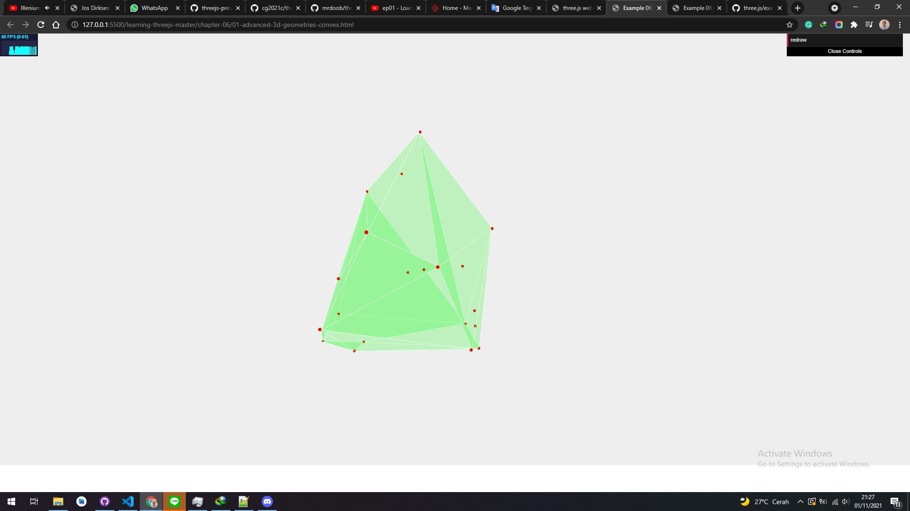

# ConvexGeometry

With THREE.ConvexGeometry, we can create a convex hull from a set of points. A convex hull is the minimal shape that encompasses all these points. The easiest way to understand this is by looking at an example. If you open up the 01-advanced-3d-geometriesconvex.html example, you'll see the convex hull for a random set of points. The following screenshot shows this geometry:

<a href="../learning-threejs-master/chapter-06/01-advanced-3d-geometries-convex.html">
  
</a>

<a href="../learning-threejs-master/chapter-06/01-advanced-3d-geometries-convex.html"><h3>CODE</h3></a>

<a href="../learning-threejs-master/chapter-06/01-advanced-3d-geometries-convex.html"><h3>CODE</h3></a>

<a href="../learning-threejs-master/chapter-06/01-advanced-3d-geometries-convex.html"><h3>CODE</h3></a>

<a href="https://cg2021c.github.io/threejs-presentation-anak-ambis/learning-threejs-master/chapter-06/01-advanced-3d-geometries-convex.html"><h3>Try Yourself</h3></a>

<a href="https://cg2021c.github.io/threejs-presentation-anak-ambis/learning-threejs-master/chapter-06/01-advanced-3d-geometries-convex.html"><h3>Try Yourself</h3></a>

<a href="https://cg2021c.github.io/threejs-presentation-anak-ambis/learning-threejs-master/chapter-06/01-advanced-3d-geometries-convex.html"><h3>Try Yourself</h3></a>

## concepts

- generate points
  - positions, (add geo and mesh. optional)
  - group the points
- pass the points to ConvexGeometry
- add mesh and render

In this example, we generate a random set of points, and based on these points, we create THREE.ConvexGeometry. In the example, you can click on redraw, which will generate 20 new points and draw the convex hull. If you try this for yourself, enable the material's transparency and set the opacity to a level below 1 to see the points that are used to create this geometry. These points are created as small THREE.SphereGeometry objects. THREE.ConvexGeometry isn't included in the standard Three.js distribution, so you have to include an additional JavaScript file to use this geometry. At the top of your HTML page, add the following:

```html
<script src="../../libs/three/geometries/ConvexGeometry.js></script>
```

To create THREE.ConvexGeometry, we need a set of points. The following code fragment shows how we do this:

```js
var spGroup;
function generatePoints() {
  if (spGroup) scene.remove(spGroup);
  var points = [];
  for (var i = 0; i < 20; i++) {
    var randomX = -15 + Math.round(Math.random() * 30);
    var randomY = -15 + Math.round(Math.random() * 30);
    var randomZ = -15 + Math.round(Math.random() * 30);
    points.push(new THREE.Vector3(randomX, randomY, randomZ));
  }
  spGroup = new THREE.Object3D();
  var material = new THREE.MeshBasicMaterial({
    color: 0xff0000,
    transparent: false,
  });
  points.forEach(function (point) {
    var spGeom = new THREE.SphereGeometry(0.2);
    var spMesh = new THREE.Mesh(spGeom, material);
    spMesh.position.copy(point);
    spGroup.add(spMesh);
  });
  // add the points as a group to the scene
  scene.add(spGroup);
}
```

As you can see in this snippet of code, we create 20 random points (THREE.Vector3), which we push into an array. Next, we iterate this array and create THREE.SphereGeometry, whose position we set to one of these points (position.copy(point)). All the points are added to a group, so we can rotate them easily by just rotating the group. Once you have this set of points, creating THREE.ConvexGeometry from them is very easy, as shown in the following code snippet:

```js
// use the same points to create a convexgeometry
var convexGeometry = new THREE.ConvexGeometry(points);
// if we want a smooth rendered object, we have to compute the vertex and
face normals
convexGeometry.computeVertexNormals();
convexGeometry.computeFaceNormals();
convexGeometry.normalsNeedUpdate = true;
```

An array containing vertices (of the THREE.Vector3 type) is the only argument THREE.ConvexGeometry takes. If you look at this code, you can see that we explicitly call computeVertexNormals and computeFaceNormals. The vertex and face normal vectors help Three.js render the geometries as a smooth object. Most geometries already do this when they are created. For this geometry, however, this isn't done when the object is created so we need to call this explicitly
