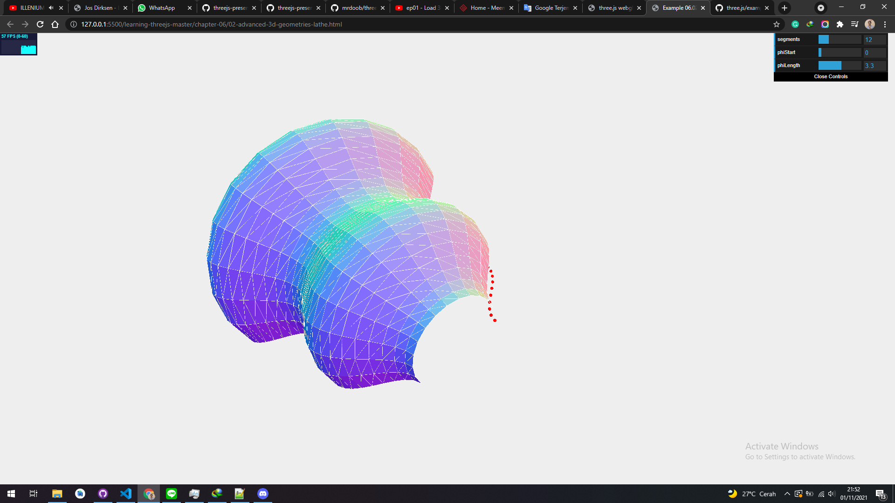

# LatheGeometry

THREE.LatheGeometry allows you to create shapes from a smooth curve. This curve is defined by a number of points (also called knots) and is most often called a spline. This spline is rotated around the central z axis of the object and results in vase-like and bell-like shapes. Once again, the easiest way to understand what THREE.LatheGeometry looks like is by looking at an example. This geometry is shown in 02-advanced-3d-geometrieslathe.html. The following screenshot taken from the example shows this geometry:

<a href="../learning-threejs-master/chapter-06/02-advanced-3d-geometries-lathe.html">
  
</a>

<a href="../learning-threejs-master/chapter-06/02-advanced-3d-geometries-lathe.html"><h3>CODE</h3></a>
<a href="../learning-threejs-master/chapter-06/02-advanced-3d-geometries-lathe.html"><h3>CODE</h3></a>
<a href="../learning-threejs-master/chapter-06/02-advanced-3d-geometries-lathe.html"><h3>CODE</h3></a>

<a href="https://cg2021c.github.io/threejs-presentation-anak-ambis/learning-threejs-master/chapter-06/02-advanced-3d-geometries-lathe.html"><h3>Try Yourself</h3></a>
<a href="https://cg2021c.github.io/threejs-presentation-anak-ambis/learning-threejs-master/chapter-06/02-advanced-3d-geometries-lathe.html"><h3>Try Yourself</h3></a>
<a href="https://cg2021c.github.io/threejs-presentation-anak-ambis/learning-threejs-master/chapter-06/02-advanced-3d-geometries-lathe.html"><h3>Try Yourself</h3></a>

In the preceding screenshot, you can see the points used to create this geometry as a set of small red spheres. The positions of these points are passed in to THREE.LatheGeometry, together with a couple of other arguments. Before we look at all the arguments, let's look at the code used to create the individual points and how THREE.LatheGeometry uses this points:

```js
function generatePoints(segments, phiStart, phiLength) {
 var points = [];
 var height = 5;
 var count = 30;
 for (var i = 0; i < count; i++) {
 points.push(new THREE.Vector3((Math.sin(i * 0.2) + Math.cos(i
 * 0.3)) * height + 12, 0, ( i - count ) + count / 2));
 }
 ...
 // use the same points to create a LatheGeometry
 var latheGeometry = new THREE.LatheGeometry (points, segments,
 phiStart, phiLength);
 latheMesh = createMesh(latheGeometry);
 scene.add(latheMesh);
}
```

In this piece of JavaScript, you can see that we generate 30 points whose x coordinate is based on a combination of sine and cosine functions, while the z coordinate is based on the i and count variables. This creates a spline visualized by the red dots in the preceding screenshot. Based on these points, we can create THREE.LatheGeometry. Besides the array of vertices, THREE.LatheGeometry takes a couple of other arguments. The following table lists all the arguments:

| Parameter | Mandatory | Description                                                                                                                                                                     |
| --------- | --------- | ------------------------------------------------------------------------------------------------------------------------------------------------------------------------------- |
| points    | Yes       | These are the points that make up the spline used to generate the bell/vase shape.                                                                                              |
| segments  | No        | These are the number of segments used when creating the shape. The higher this number, the more round and smooth the resulting shape will be. The default value for this is 12. |
| phiStart  | No        | This determines where to start on a circle when generating the shape. This can range from 0 to 2 \* PI. The default value is 0.                                                 |
| phiLength | No        | This defines how fully generated the shape is. For instance, a quarter shape will be 0.5 _ PI. The default value is the full 360 degrees or 2 _ PI.                             |

## concepts

- generate points
  - positions, (add geo and mesh. optional)
  - group the points
- pass the points to LatheGeometry
- add mesh and render
