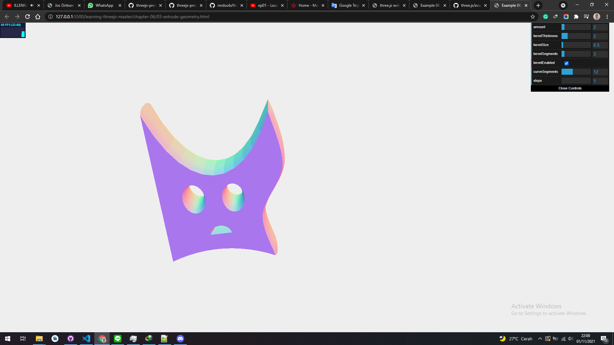

# ExtrudeGeometry

Creating a geometry by extruding. Three.js provides a couple of ways in which we can extrude a 2D shape to a 3D shape. By extruding, we mean stretching out a 2D shape along its z axis to convert it to 3D. For instance, if we extrude a THREE.CircleGeometry, we get a shape that looks like a cylinder, and if we extrude THREE.PlaneGeometry, we get a cube-like shape. The most versatile way of extruding a shape is using the THREE.ExtrudeGeometry object.

With THREE.ExtrudeGeometry, we can create a 3D object from a 2D shape. Before we dive into the details of this geometry, let's first look at an example: 03-extrudegeometry.html. The following screenshot taken from the example shows this geometry:

<a href="../learning-threejs-master/chapter-06/03-extrude-geometry.html">
  
</a>

<a href="../learning-threejs-master/chapter-06/03-extrude-geometry.html"><h3>CODE</h3></a>

<a href="../learning-threejs-master/chapter-06/03-extrude-geometry.html"><h3>CODE</h3></a>

<a href="../learning-threejs-master/chapter-06/03-extrude-geometry.html"><h3>CODE</h3></a>

<a href="https://cg2021c.github.io/threejs-presentation-anak-ambis/learning-threejs-master/chapter-06/03-extrude-geometry.html"><h3>Try Yourself</h3></a>

<a href="https://cg2021c.github.io/threejs-presentation-anak-ambis/learning-threejs-master/chapter-06/03-extrude-geometry.html"><h3>Try Yourself</h3></a>

<a href="https://cg2021c.github.io/threejs-presentation-anak-ambis/learning-threejs-master/chapter-06/03-extrude-geometry.html"><h3>Try Yourself</h3></a>

In this example, we took the 2D shape we created in the previously and used THREE.ExtrudeGeometry to convert it to 3D. As we can see in this screenshot, the shape is extruded along the z axis, which results in a 3D shape. The code to create THREE.ExtrudeGeometry is very easy, in this section we try to use code example from threejs documentation:

```js
const length = 12, width = 8;

const shape = new THREE.Shape();
shape.moveTo( 0,0 );
shape.lineTo( 0, width );
shape.lineTo( length, width );
shape.lineTo( length, 0 );
shape.lineTo( 0, 0 );

const extrudeSettings = {
	steps: 2,
	depth: 16,
	bevelEnabled: true,
	bevelThickness: 1,
	bevelSize: 1,
	bevelOffset: 0,
	bevelSegments: 1
};

const geometry = new THREE.ExtrudeGeometry( shape, extrudeSettings );
const material = new THREE.MeshBasicMaterial( { color: 0x00ff00 } );
const mesh = new THREE.Mesh( geometry, material ) ;
scene.add( mesh );
```

In this code, we created the shape with the new THREE.Shape() . This shape is passed on to the THREE.ExtrudeGeometry constructor together with an extrudeSettings object. With the extrudeSettings object, we can define exactly how the shape should be extruded. The following table explains the options we can pass in
to THREE.ExtrudeGeometry:

| Parameter      | Mandatory | Description                                                                                                                                                                                                                                                                                                                                                                                                                                                  |
| -------------- | --------- | ------------------------------------------------------------------------------------------------------------------------------------------------------------------------------------------------------------------------------------------------------------------------------------------------------------------------------------------------------------------------------------------------------------------------------------------------------------ |
| shapes         | Yes       | One or more shapes (THREE.Shape objects) are required to extrude the geometry from. See the preceding chapter on how to create such a shape.                                                                                                                                                                                                                                                                                                                 |
| amount         | No        | This determines how far (the depth) the shape should be extruded. The default value is 100                                                                                                                                                                                                                                                                                                                                                                   |
| bevelThickness | No        | This determines the depth of the bevel. The bevel is the rounded corner between the front and back faces and the extrusion. This value defines how deep into the shape the bevel goes. The default value is 6.                                                                                                                                                                                                                                               |
| bevelSize      | No        | This determines the height of the bevel. This is added to the normal height of the shape. The default value is bevelThickness - 2.                                                                                                                                                                                                                                                                                                                           |
| bevelSegments  | No        | This defines the number of segments that will be used by the bevel. The more the number of segments used, the smoother the bevel will look. The default value is 3.                                                                                                                                                                                                                                                                                          |
| bevelEnabled   | No        | If this is set to true, a bevel is added. The default value is true.                                                                                                                                                                                                                                                                                                                                                                                         |
| curveSegments  | No        | This determines how many segments will be used when extruding the curves of shapes. The more the number of segments used, the smoother the curves will look. The default value is 12.                                                                                                                                                                                                                                                                        |
| steps          | No        | This defines the number of segments into the extrusion will be divided along its depth. The default value is 1. A higher value will result in more individual faces.                                                                                                                                                                                                                                                                                         |
| extrudePath    | No        | This is the path (THREE.CurvePath) along which the shape should be extruded. If this isn't specified, the shape is extruded along the z axis                                                                                                                                                                                                                                                                                                                 |
| uvGenerator    | No        | When we use a texture with our material, the UV mapping determines what part of a texture is used for a specific face. With the uvGenerator property, we can pass in our own object that will create the UV settings for the faces that are created for the shapes that are passed in. More information on UV settings can be found in Chapter 10, Loading and Working with Textures. If none are specified, THREE.ExtrudeGeometry.WorldUVGenerator is used. |

## ExtrudeGeometry

extends BufferGeometry

Creates extruded geometry from a path shape.


### Constructor

ExtrudeGeometry(shapes : Array, options : Object)

shapes — Shape or an array of shapes.

options — Object that can contain the following parameters.

curveSegments — int. Number of points on the curves. Default is 12.

steps — int. Number of points used for subdividing segments along the depth of the extruded spline. Default is 1.

depth — float. Depth to extrude the shape. Default is 1.

bevelEnabled — bool. Apply beveling to the shape. Default is true.

bevelThickness — float. How deep into the original shape the bevel goes. Default is 0.2.

bevelSize — float. Distance from the shape outline that the bevel extends. Default is bevelThickness - 0.1.

bevelOffset — float. Distance from the shape outline that the bevel starts. Default is 0.

bevelSegments — int. Number of bevel layers. Default is 3.

extrudePath — THREE.Curve. A 3D spline path along which the shape should be extruded. Bevels not supported for path extrusion.

UVGenerator — Object. object that provides UV generator functions

This object extrudes a 2D shape to a 3D geometry.

When creating a Mesh with this geometry, if you'd like to have a separate material used for its face and its extruded sides, you can use an array of materials. The first material will be applied to the face; the second material will be applied to the sides.

### Properties

See the base <a href="https://threejs.org/docs/index.html?q=lathe#api/en/core/BufferGeometry">BufferGeometry</a> class for common properties.

.parameters : Object

An object with a property for each of the constructor parameters. Any modification after instantiation does not change the geometry.

### Methods

See the base <a href="https://threejs.org/docs/index.html?q=lathe#api/en/core/BufferGeometry">BufferGeometry</a> class for common methods.

### Source

<a href="https://github.com/mrdoob/three.js/blob/master/src/geometries/ExtrudeGeometry.js">src/geometries/ExtrudeGeometry.js</a>
