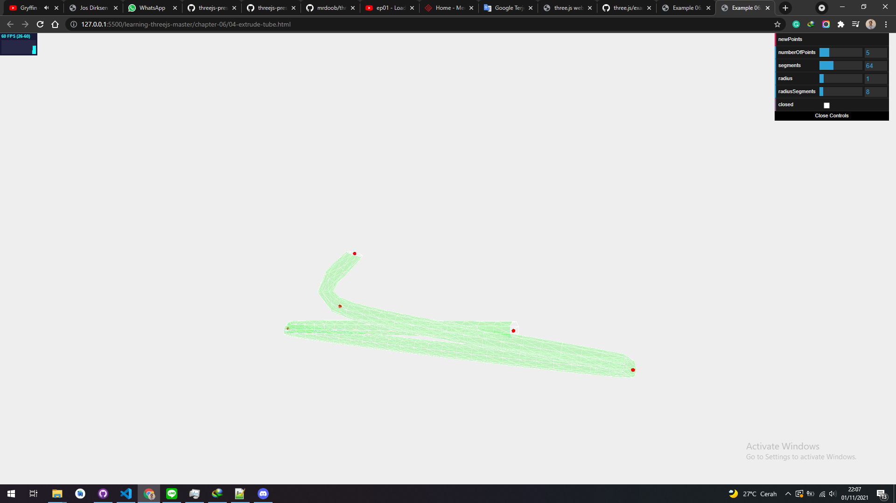

# TubeGeometry

THREE.TubeGeometry creates a tube that extrudes along a 3D spline. we specify the path using a number of vertices, and THREE.TubeGeometry will create the tube. An example that we can experiment with can be found in the sources for this chapter (04-extrudetube.html). The following screenshot shows this example:

<a href="../learning-threejs-master/chapter-06/04-extrude-tube.html">
  
</a>

<a href="../learning-threejs-master/chapter-06/04-extrude-tube.html"><h3>CODE</h3></a>

<a href="../learning-threejs-master/chapter-06/04-extrude-tube.html"><h3>CODE</h3></a>

<a href="../learning-threejs-master/chapter-06/04-extrude-tube.html"><h3>CODE</h3></a>

<a href="https://cg2021c.github.io/threejs-presentation-anak-ambis/learning-threejs-master/chapter-06/04-extrude-tube.html"><h3>Try Yourself</h3></a>

<a href="https://cg2021c.github.io/threejs-presentation-anak-ambis/learning-threejs-master/chapter-06/04-extrude-tube.html"><h3>Try Yourself</h3></a>

<a href="https://cg2021c.github.io/threejs-presentation-anak-ambis/learning-threejs-master/chapter-06/04-extrude-tube.html"><h3>Try Yourself</h3></a>

As we can see in this example, we generate a number of random points and use those points to draw the tube. With the controls in the upper-right corner, we can define how the tube looks or generate a new tube by clicking on the newPoints button. The code needed to create a tube is very simple, as follows:

```js
var points = [];
for (var i = 0; i < controls.numberOfPoints; i++) {
  var randomX = -20 + Math.round(Math.random() * 50);
  var randomY = -15 + Math.round(Math.random() * 40);
  var randomZ = -20 + Math.round(Math.random() * 40);
  points.push(new THREE.Vector3(randomX, randomY, randomZ));
}
var tubeGeometry = new THREE.TubeGeometry(
  new THREE.CatmullRomCurve3(points),
  segments,
  radius,
  radiusSegments,
  closed
);
var tubeMesh = createMesh(tubeGeometry);
scene.add(tubeMesh);
```

What we need to do first is get a set of vertices of the THREE.Vector3 type just like we did for THREE.ConvexGeometry and THREE.LatheGeometry. Before we can use these points, however, to create the tube, we first need to convert these points to a THREE.CatmullRomCurve3. In other words, we need to define a smooth curve through the points we defined. We can do this simply by passing in the array of vertices to the constructor of THREE.CatmullRomCurve3. With this curve and the other arguments (which we'll explain in a bit), we can create the tube and add it to the scene. THREE.TubeGeometry takes some other arguments besides THREE.SplineCurve3. The following table lists all the arguments for THREE.TubeGeometry:

| Parameter      | Mandatory | Description                                                                                                                                          |
| -------------- | --------- | ---------------------------------------------------------------------------------------------------------------------------------------------------- |
| path           | Yes       | This is THREE.SplineCurve3 that describes the path this tube should follow.                                                                          |
| segments       | No        | These are the segments used to build up the tube. The default value is 64. The longer the path, the more segments we should specify                 |
| radius         | No        | This is the radius of the tube. The default value is 1                                                                                               |
| radiusSegments | No        | This is the number of segments to be used along the length of the tube. The default value is 8. The more we use, the more round the tube will look. |
| closed         | No        | If this is set to true, the start of the tube and the end will be connected together. The default value is false.                                    |

<a href="https://threejs.org/docs/index.html?q=TubeGeometry#api/en/geometries/TubeGeometry">THREEJS docs:</a>

## TubeGeometry

extends  BufferGeometry

Creates a tube that extrudes along a 3d curve.

### Code Example

```js
class CustomSinCurve extends THREE.Curve {

	constructor( scale = 1 ) {

		super();

		this.scale = scale;

	}

	getPoint( t, optionalTarget = new THREE.Vector3() ) {

		const tx = t * 3 - 1.5;
		const ty = Math.sin( 2 * Math.PI * t );
		const tz = 0;

		return optionalTarget.set( tx, ty, tz ).multiplyScalar( this.scale );

	}

}

const path = new CustomSinCurve( 10 );
const geometry = new THREE.TubeGeometry( path, 20, 2, 8, false );
const material = new THREE.MeshBasicMaterial( { color: 0x00ff00 } );
const mesh = new THREE.Mesh( geometry, material );
scene.add( mesh );
```

### Constructor

TubeGeometry(path : Curve, tubularSegments : Integer, radius : Float, radialSegments : Integer, closed : Boolean)

path — Curve - A 3D path that inherits from the Curve base class. Default is a quadratic bezier curve.
tubularSegments — Integer - The number of segments that make up the tube. Default is 64.
radius — Float - The radius of the tube. Default is 1.
radialSegments — Integer - The number of segments that make up the cross-section. Default is 8.
closed — Boolean Is the tube open or closed. Default is false.

### Properties

See the base <a href="https://threejs.org/docs/index.html?q=lathe#api/en/core/BufferGeometry">BufferGeometry</a> class for common properties.

.parameters : Object
An object with a property for each of the constructor parameters. Any modification after instantiation does not change the geometry.

.tangents : Array
An array of Vector3 tangents

.normals : Array
An array of Vector3 normals

.binormals : Array
An array of Vector3 binormals

### Methods

See the base <a href="https://threejs.org/docs/index.html?q=lathe#api/en/core/BufferGeometry">BufferGeometry</a> class for common methods.

### Source

<a href="https://github.com/mrdoob/three.js/blob/master/src/geometries/TubeGeometry.js">src/geometries/TubeGeometry.js</a>
