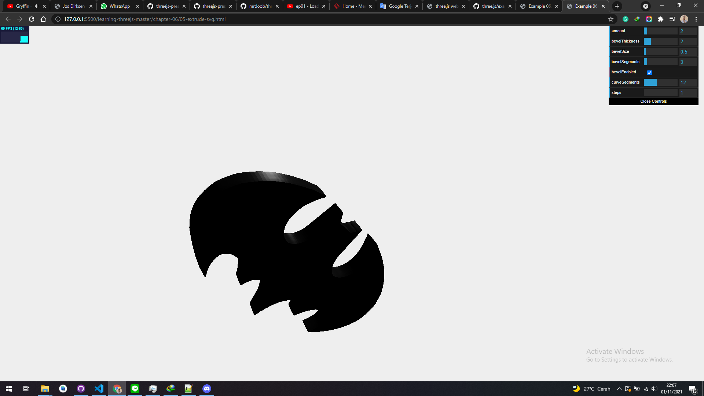

# ShapeGeometry

Extruding from SVG When we discussed THREE.ShapeGeometry, we mentioned that SVG follows pretty much the same approach of drawing shapes. SVG very closely matches how Three.js handles shapes. In this section, we'll look at how you can use a small library from https://github.com/asutherland/d3-threeD to convert SVG paths to a Three.js shape (Three.js also provides a specific THREE.SVGLoader, which is explained in Chapter 8, Creating and Loading Advanced Meshes and Geometries). For the 05-extrudesvg.html example, we've taken an SVG drawing of the Batman logo and used ExtrudeGeometry to convert it to 3D, as shown in the following screenshot:

<a href="../learning-threejs-master/chapter-06/05-extrude-svg.html">
  
</a>

<a href="../learning-threejs-master/chapter-06/05-extrude-svg.html"><h3>CODE</h3></a>

<a href="../learning-threejs-master/chapter-06/05-extrude-svg.html"><h3>CODE</h3></a>

<a href="../learning-threejs-master/chapter-06/05-extrude-svg.html"><h3>CODE</h3></a>

<a href="https://cg2021c.github.io/threejs-presentation-anak-ambis/learning-threejs-master/chapter-06/05-extrude-svg.html"><h3>Try Yourself</h3></a>

<a href="https://cg2021c.github.io/threejs-presentation-anak-ambis/learning-threejs-master/chapter-06/05-extrude-svg.html"><h3>Try Yourself</h3></a>

<a href="https://cg2021c.github.io/threejs-presentation-anak-ambis/learning-threejs-master/chapter-06/05-extrude-svg.html"><h3>Try Yourself</h3></a>

The following code fragment shows how we can load in the SVG you saw earlier, convert it to THREE.ExtrudeGeometry, and show it on screen:

```js
function drawShape() {
  var svgString = document.querySelector("#batman-path").getAttribute("d");
  var shape = transformSVGPathExposed(svgString);
  return shape;
}
var options = {
  amount: 10,
  bevelThickness: 2,
  bevelSize: 1,
  bevelSegments: 3,
  bevelEnabled: true,
  curveSegments: 12,
  steps: 1,
};
shape = createMesh(new THREE.ExtrudeGeometry(drawShape(), options));
```

In this code fragment, you'll see a call to the transformSVGPathExposed function. This function is provided by the d3-threeD library and takes an SVG string as an argument. We get this SVG string directly from the SVG element with the following expression: document.querySelector("#batman-path").getAttribute("d"). In SVG, the d attribute contains the path statements used to draw a shape. Add a nice-looking shiny material and a spotlight and you've recreated this example.
