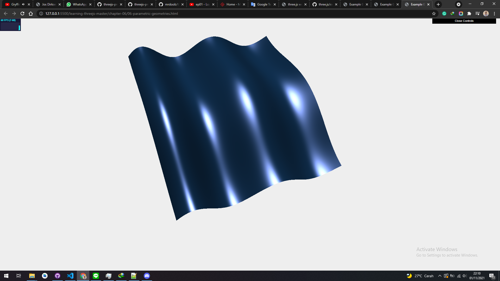

# ParametricGeometry

With THREE.ParametricGeometry, we can create a geometry based on an equation. Before we dive into our own example, a good thing to start with is to look at the examples already provided by Three.js. When we download the Three.js distribution, we get the examples/js/ParametricGeometries.js file. In this file, we can find a couple of examples of equations we can use together with THREE.ParametricGeometry. The most basic example is the function to create a plane:

```js
plane: function ( width, height ) {
 return function ( u, v, optionalTarget ) {
 var result = optionalTarget || new THREE.Vector3();
 var x = u * width;
 var y = 0;
 var z = v * height;
 return result.set( x, y, z );
 };
 }
```

This function is called by THREE.ParametricGeometry. The u and v values will range from 0 to 1 and will be called a large number of times for all the values from 0 to 1. In this example, the u value is used to determine the x coordinate of the vector and the v value is used to determine the z coordinate. When this is run, we'll have a basic plane with a width of width and a depth of depth.

In our example, we do something similar. However, instead of creating a flat plane, we create a wave-like pattern, as we can see in the 06-parametricgeometries.html example. The following screenshot shows this example:

<a href="../learning-threejs-master/chapter-06/06-parametric-geometries.html">
  
</a>

<a href="../learning-threejs-master/chapter-06/06-parametric-geometries.html"><h3>CODE</h3></a>

<a href="../learning-threejs-master/chapter-06/06-parametric-geometries.html"><h3>CODE</h3></a>

<a href="../learning-threejs-master/chapter-06/06-parametric-geometries.html"><h3>CODE</h3></a>

<a href="https://cg2021c.github.io/threejs-presentation-anak-ambis/learning-threejs-master/chapter-06/06-parametric-geometries.html"><h3>Try Yourself</h3></a>

<a href="https://cg2021c.github.io/threejs-presentation-anak-ambis/learning-threejs-master/chapter-06/06-parametric-geometries.html"><h3>Try Yourself</h3></a>

<a href="https://cg2021c.github.io/threejs-presentation-anak-ambis/learning-threejs-master/chapter-06/06-parametric-geometries.html"><h3>Try Yourself</h3></a>

In this example, we can also see the arguments we can pass
to THREE.ParametricGeometry. These are explained in the following table:

| Parameter | Mandatory | Description                                                                                         |
| --------- | --------- | --------------------------------------------------------------------------------------------------- |
| function  | Yes       | This is the function that defines the position of each vertex based on the u and v values provided. |
| slices    | Yes       | This defines the number of parts the u value should be divided into.                                |
| stacks    | Yes       | This defines the number of parts the v value should be divided into.                                |


## ParametricGeometry

extends BufferGeometry

Generate geometry representing a parametric surface.

### Code Example

```js
const geometry = new THREE.ParametricGeometry( THREE.ParametricGeometries.klein, 25, 25 );
const material = new THREE.MeshBasicMaterial( { color: 0x00ff00 } );
const klein = new THREE.Mesh( geometry, material );
scene.add( klein );
```

### Constructor

ParametricGeometry(func : Function, slices : Integer, stacks : Integer)
func — A function that takes in a u and v value each between 0 and 1 and modifies a third Vector3 argument. Default is a function that generates a curved plane surface.
slices — The count of slices to use for the parametric function. Default is 8.
stacks — The count of stacks to use for the parametric function. Default is 8.

### Properties

See the base <a href="https://threejs.org/docs/index.html?q=lathe#api/en/core/BufferGeometry">BufferGeometry</a> class for common properties.

.parameters : Object

An object with a property for each of the constructor parameters. Any modification after instantiation does not change the geometry.

### Methods

See the base <a href="https://threejs.org/docs/index.html?q=lathe#api/en/core/BufferGeometry">BufferGeometry</a> class for common methods.

### Source

<a href="https://github.com/mrdoob/three.js/blob/master/src/geometries/ParametricGeometry.js">src/geometries/ParametricGeometry.js</a>

