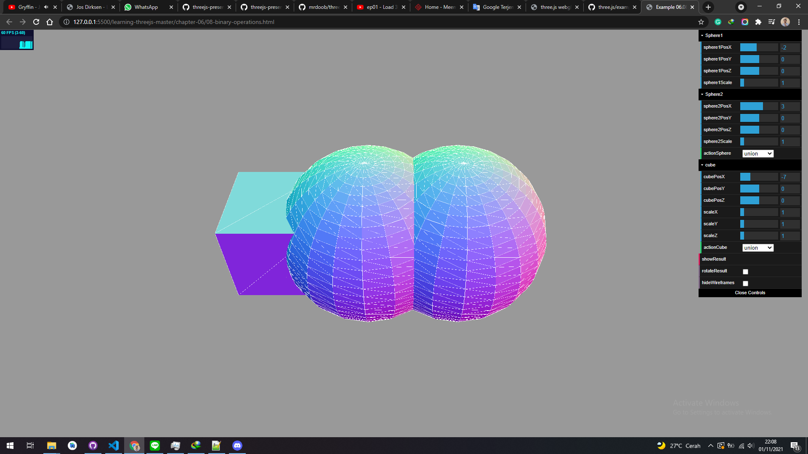
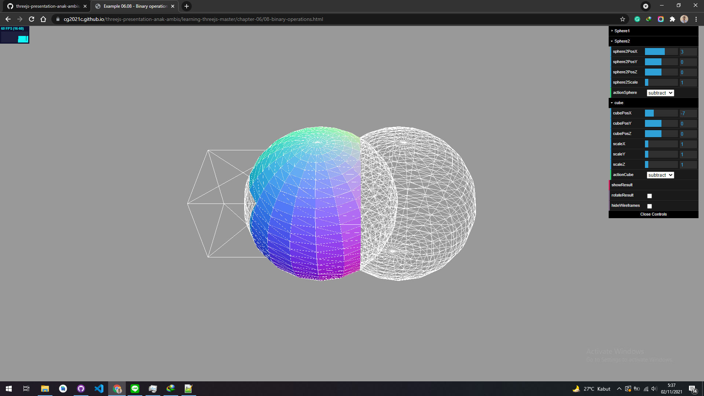
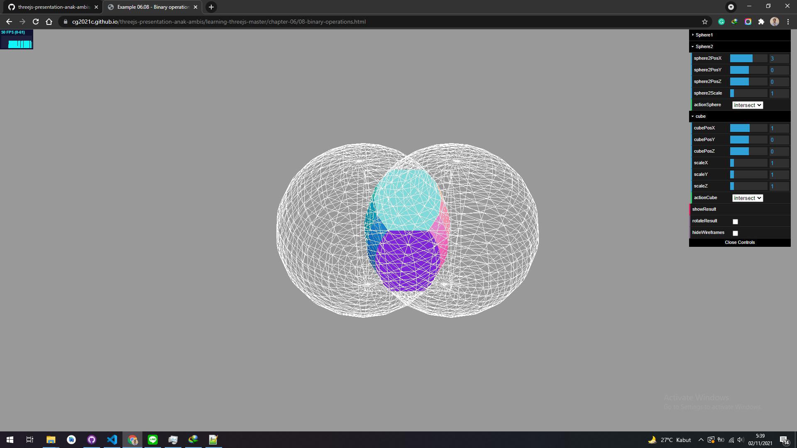

# Using binary operations to combine meshes

In this section, we'll look at a different way of creating geometries. In this chapter so far, and in the previous Chapter 5, Learning to Work with Geometries, we used the default geometries provided by Three.js to create interesting-looking geometries. With the default set of properties, you can create beautiful models, but you are limited to what Three.js provides. In this section, we'll show you how you can combine these standard geometries to create new ones-a technique known as Constructive Solid Geometry (CSG). To do this, we use the Three.js extension ThreeBSP, which you can find online at https://github.com/skalnik/ThreeBSP. This additional library provides the following three functions:

| Parameter | Mandatory | Description                                                                                         |
| --------- | --------- | --------------------------------------------------------------------------------------------------- |
| function  | Yes       | This is the function that defines the position of each vertex based on the u and v values provided. |
| slices    | Yes       | This defines the number of parts the u value should be divided into.                                |
| stacks    | Yes       | This defines the number of parts the v value should be divided into.                                |

In the following sections, we'll look at each of these functions in more detail. The following screenshot shows an example of what you can create by just using the union and subtract functionalities one after the other:

|  Action   |                                                   Result                                                    |
| :-------: | :---------------------------------------------------------------------------------------------------------: |
|   union   |  <a href="../learning-threejs-master/chapter-06/08-binary-operations.html"> </a>  |
|   :---:   |                                                    :---:                                                    |
| substract | <a href="../learning-threejs-master/chapter-06/08-binary-operations.html"> </a> |
|   :---:   |                                                    :---:                                                    |
| intersect | <a href="../learning-threejs-master/chapter-06/08-binary-operations.html"> </a> |

<a href="https://cg2021c.github.io/threejs-presentation-anak-ambis/learning-threejs-master/chapter-06/08-binary-operations.html"><h3>Try Yourself</h3></a>

To use this library, we need to include it in our page. This library is written in CoffeeScript, a more user-friendly variant of JavaScript. To get this working, we have two options. We can add the CoffeeScript file and compile it on the fly, or we can precompile it to JavaScript and include it directly. For the first approach, we need to do the following:

```html
<script type="text/javascript" src="../libs/coffee-script.js"></script>
<script type="text/coffeescript" src="../libs/ThreeBSP.coffee"></script>
```

The ThreeBSP.coffee file contains the functionality we need for this example, and coffee-script.js can interpret the Coffee language used for ThreeBSP. A final step we need to take is make sure the ThreeBSP.coffee file has been parsed completely before we start using the ThreeBSP functionality. For this, we add the following to the bottom of the file:

```html
<script type="text/coffeescript">
  onReady();
</script>
```

We rename our initial onload function to onReady like this:

```js
function onReady() {
  // Three.js code
}
```

If we precompile CoffeeScript to JavaScript using the CoffeeScript command-line tool, we can include the resulting JavaScript file directly. Before we can do this, though, we need to install CoffeeScript. You can follow the installation instructions on the CoffeeScript website at http://coffeescript.org/. Once you've installed CoffeeScript, you can use the following command line to convert the CoffeeScript ThreeBSP file to JavaScript:

```js
coffee --compile ThreeBSP.coffee
```

This command creates a ThreeBSP.js file that we can include in our example just as we do with the other JavaScript file. In our examples, we use this second approach because it'll load quicker than compiling the CoffeeScript each time we load the page. For this, all we need to do is add the following to the top of our HTML page:

```html
<script type="text/javascript" src="../libs/ThreeBSP.js"></script>
```

Supported Operation:

- substract
- intersect
- union
