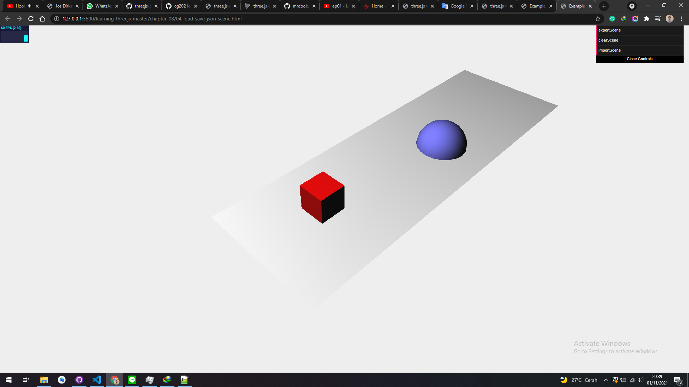

# SAVE JSON SCENE

If we want to export a scene it has the same method such as loading and saving object.

<a href="../learning-threejs-master\chapter-08\04-load-save-json-scene.html#L122">ExportScene Function</a>

```js
this.exportScene = function () {
  var exporter = new THREE.SceneExporter(); // the exporter
  var sceneJson = JSON.stringify(exporter.parse(scene));
  localStorage.setItem("scene", sceneJson);

  console.log(sceneJson);
  document.getElementById("my-div").innerHTML = sceneJson;

  /* func to get the export file */
  // function download(content, fileName, contentType) {
  //     var a = document.createElement("a");
  //     var file = new Blob([content], {type: contentType});
  //     a.href = URL.createObjectURL(file);
  //     a.download = fileName;
  //     a.click();
  // }
  // download(sceneJson, 'json.txt', 'text/plain');
};
```

<a href="../learning-threejs-master\chapter-08\04-load-save-json-scene.html#L145">importScene Function</a>

```js
this.importScene = function () {
  var json = localStorage.getItem("scene");
  var sceneLoader = new THREE.SceneLoader();

  sceneLoader.parse(
    JSON.parse(json),
    function (e) {
      scene = e.scene;
    },
    "."
  );
};
```

In this example, you've got three options: exportScene, clearScene, and importScene.
With exportScene, the current state of the scene will be saved in the browser's local storage.
To test the import functionality, you can remove the scene by clicking on
the clearScene button and loading it from local storage with the importScene button. The
JavaScript needed for this is trivial:

```js
localStorage.setItem("scene", JSON.stringify(scene.toJSON()));
```

This approach is exactly the same as we used in the previous section, only this time we
export the THREE.Scene object, instead of the individual mesh:

```js
{
 "metadata": {
 "version": 4.5,
 "type": "Object",
 "generator": "Object3D.toJSON"
 },
...
}
```


