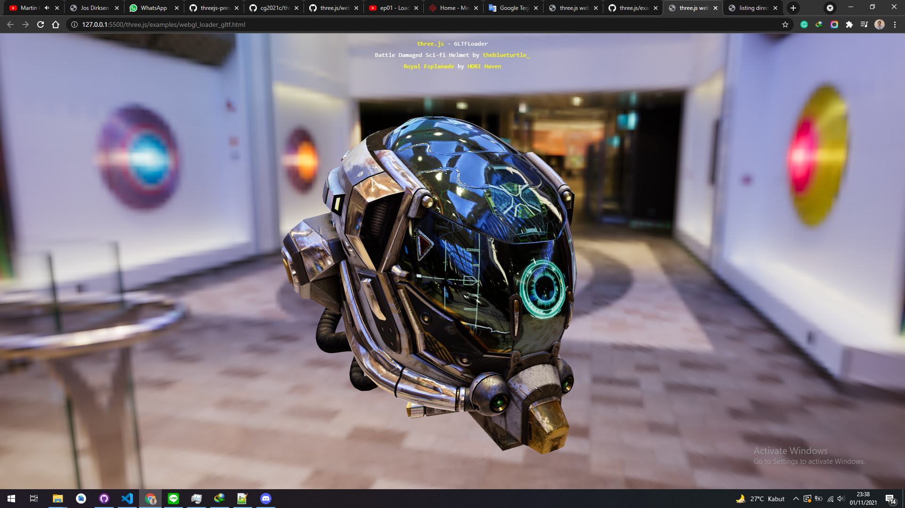

# Working with Blender

## Installing the Three.js exporter in Blender (NOT SUPPORTED BY BLENDER AND THREE JS ANYMORE)

Next, you need to get the Three.js distribution and unpack it locally. In this distribution, you can find the following folder: utils/exporters/blender/addons/. In this directory, there is a single subdirectory with the name io_three. Copy this directory to the addons folder of your Blender installation.

Now all we need to do is start Blender and enable the exporter. In Blender, open Blender User Preferences (File | User Preferences). In the window that opens, select the Addons tab, and, in the Search box, type three.

When you open this for the first time, the Three.js plugin is still disabled. Check the small checkbox to the right, and the Three.js exporter will be enabled. As a final check to see whether everything is working correctly, open the File | Export menu option, and you'll see Three.js listed as an Export option.

## Use the GLTFLoader for importing and exporting object from blender

In order to use a supported method for importing and exporting object to blender, we need GLTFLoader. The file that can be load is .gltf and .glb. Here is the example of the code to make it more clear:

<a href="https://github.com/mrdoob/three.js/blob/master/examples/webgl_loader_gltf.html">

</a>

```js
import * as THREE from "../build/three.module.js";

import { OrbitControls } from "./jsm/controls/OrbitControls.js";
import { GLTFLoader } from "./jsm/loaders/GLTFLoader.js";
import { RGBELoader } from "./jsm/loaders/RGBELoader.js";
import { RoughnessMipmapper } from "./jsm/utils/RoughnessMipmapper.js";

let camera, scene, renderer;

init();
render();

function init() {
  const container = document.createElement("div");
  document.body.appendChild(container);

  camera = new THREE.PerspectiveCamera(
    45,
    window.innerWidth / window.innerHeight,
    0.25,
    20
  );
  camera.position.set(-1.8, 0.6, 2.7);

  scene = new THREE.Scene();

  new RGBELoader()
    .setPath("textures/equirectangular/")
    .load("royal_esplanade_1k.hdr", function (texture) {
      texture.mapping = THREE.EquirectangularReflectionMapping;

      scene.background = texture;
      scene.environment = texture;

      render();

      // model

      // use of RoughnessMipmapper is optional
      const roughnessMipmapper = new RoughnessMipmapper(renderer);

      const loader = new GLTFLoader().setPath(
        "models/gltf/DamagedHelmet/glTF/"
      );
      loader.load("DamagedHelmet.gltf", function (gltf) {
        gltf.scene.traverse(function (child) {
          if (child.isMesh) {
            roughnessMipmapper.generateMipmaps(child.material);
          }
        });

        scene.add(gltf.scene);

        roughnessMipmapper.dispose();

        render();
      });
    });

  renderer = new THREE.WebGLRenderer({ antialias: true });
  renderer.setPixelRatio(window.devicePixelRatio);
  renderer.setSize(window.innerWidth, window.innerHeight);
  renderer.toneMapping = THREE.ACESFilmicToneMapping;
  renderer.toneMappingExposure = 1;
  renderer.outputEncoding = THREE.sRGBEncoding;
  container.appendChild(renderer.domElement);

  const controls = new OrbitControls(camera, renderer.domElement);
  controls.addEventListener("change", render); // use if there is no animation loop
  controls.minDistance = 2;
  controls.maxDistance = 10;
  controls.target.set(0, 0, -0.2);
  controls.update();

  window.addEventListener("resize", onWindowResize);
}

function onWindowResize() {
  camera.aspect = window.innerWidth / window.innerHeight;
  camera.updateProjectionMatrix();

  renderer.setSize(window.innerWidth, window.innerHeight);

  render();
}

//

function render() {
  renderer.render(scene, camera);
}
```
